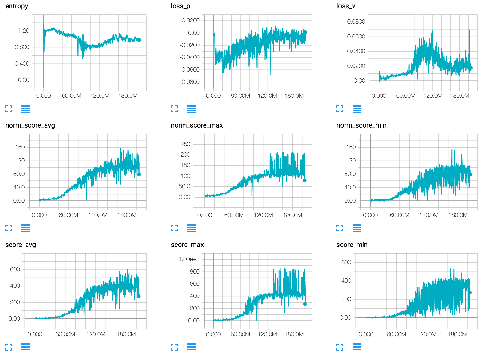

# PAAC.pytorch
Pytorch implementation of the PAAC algorithm presented in "Efficient Parallel Methods for Deep Reinforcement Learning". PAAC is the abbreviation of Parallel Advantage Actor-Critic.

Currently, because the PAAC network is not using LSTM, the evaluation result is not very good. I'm working on the LSTM version of PAAC.

The original paper is here: https://arxiv.org/abs/1705.04862

# Requirements
PAAC.pytorch requires torch, torchvision, PIL, gym.

Libraries used in this project:

* torch==0.1.12+32e6665
* torchvision==0.1.8
* Pillow==4.1.1
* gym@797a25d1b1a8823b305fdb575c4378a5c288b432

# Result (BreakoutDeterministic-v4 training log)

